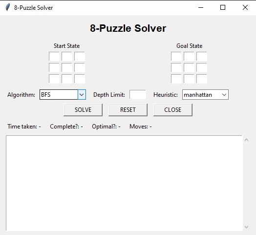
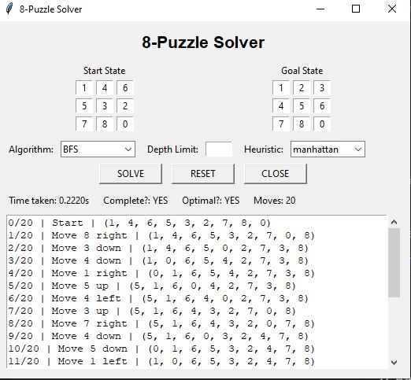

# 8-Puzzle Solver (Python)

A complete AI-powered **8-Puzzle (Sliding Puzzle)** solver implemented in Python.  
This project demonstrates **state-space search**, **heuristics**, and **algorithmic problem-solving** using both **uninformed** and **informed** search strategies.

The solver takes an initial puzzle state, searches for a valid path to the goal configuration, and returns the **solution sequence**, **moves**, and **visualizable path**.

---

## 🚀 Features
- Supports multiple **uninformed** and **informed** search algorithms:

### Uninformed Search
- ✔ Breadth-First Search (BFS)  
- ✔ Depth-First Search (DFS)  
- ✔ Depth-Limited Search (DLS)  
- ✔ Iterative Deepening Search (IDS)  
- ✔ Bidirectional Search  

### Informed Search
- ✔ A* Search (Misplaced Tile heuristic)  
- ✔ A* Search (Manhattan Distance heuristic)  

- Modular and clean project structure  
- Efficient tuple-based state representation  
- Move reconstruction from parent mappings  
- Solvability checking  

---

## 🧠 How It Works

The 8-Puzzle consists of tiles numbered **1–8** and one blank space **0** on a 3×3 grid.  
The goal is to transform a starting configuration into a target configuration using legal moves:

- `UP`
- `DOWN`
- `LEFT`
- `RIGHT`

Heuristic search algorithms (A*) use cost functions to speed up solving and reduce unnecessary exploration.

---

## 📁 Project Structure

/project-root
│── informed_algorithms.py
│── uninformed_algorithms.py
│── utils/
│ └── puzzle_utils.py
│── main.py


---

## 📦 Installation & Setup

### Clone the repository
```bash
git clone https://github.com/yourusername/8-puzzle-solver.git
cd 8-puzzle-solver

python -m venv venv
source venv/bin/activate   # Linux/Mac
venv\Scripts\activate      # Windows

python main.py
```

## 🖼 Screenshots




## 🛠 Technologies Used
- Python 3
- Search Algorithms
- Heuristic Optimization
- (Optional) Tkinter GUI
